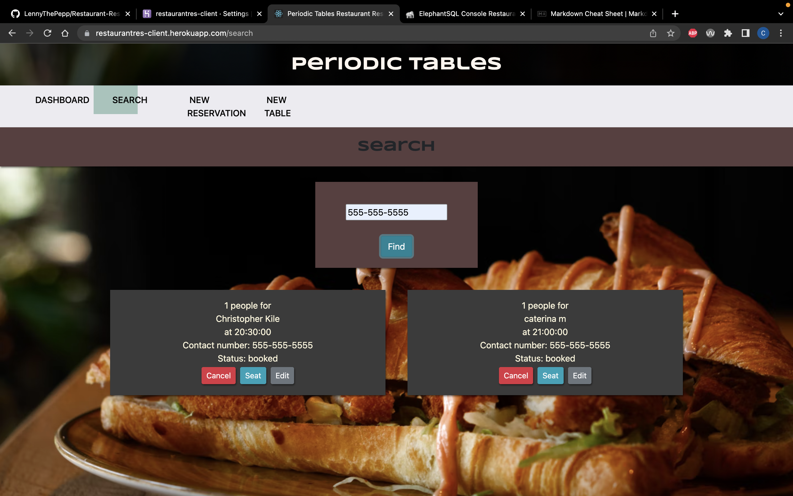

# Periodic Tables Restaurant Reservation Application

This application was made with React.js / Express.js / Knex.js / Node.js / PostgreSql / Bootstrap

The application is a simple reservation managment system for restaurants to use on a day to day basis while keeping track of past and future reservations.

The user can :

-  Create / Update / Delete reservations
-  Assign those reservations to specific tables
-  Create Tables themselves
-  Search for reservations by phone number
-  Seat reservation when the customer arrives

The front-end portion of the application was made with React.js and CSS/Bootstrap.
The database was made using Express.js with migrations done using Knex.js. Which was designed using RESTful API principles and Elephant PostgreSQL.

All of which were deployed using Heroku.

[Periodic Tables Link](https://restaurantres-client.herokuapp.com/)

### Some images of the application(dashboard, search, reservation, new table)

